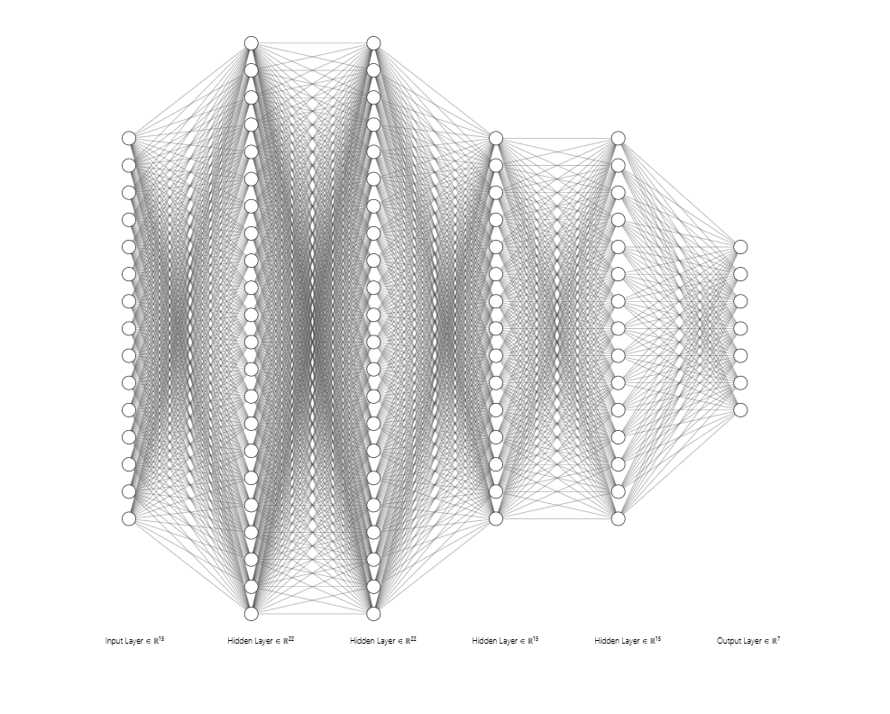
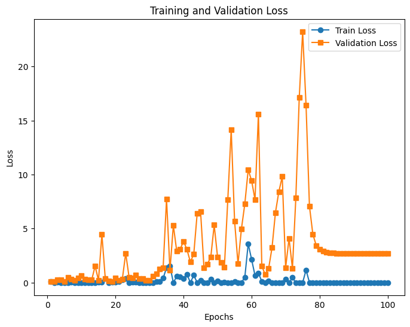
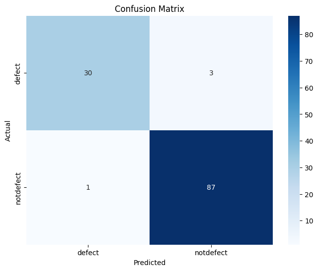
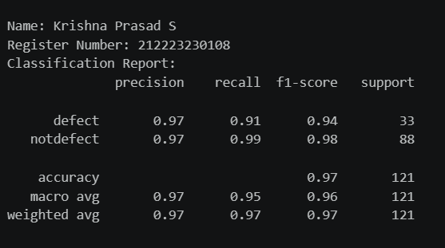
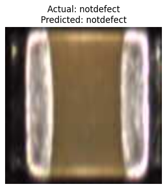

# DL- Developing a Neural Network Classification Model using Transfer Learning

## AIM
To develop an image classification model using transfer learning with VGG19 architecture for the given dataset.

## Problem Statement and Dataset
Transfer Learning is a technique where a pre-trained model (trained on a large dataset such as ImageNet) is used as a starting point for a different but related task. It leverages learned features from the original task to improve learning efficiency and performance on the new task.

VGG19 is a convolutional neural network with 19 layers. It consists of multiple convolutional layers for feature extraction, followed by fully connected layers for classification. In transfer learning, we typically freeze the convolutional layers and retrain the final fully connected layers to match our dataset.

## Neural Network Model


## DESIGN STEPS
### STEP 1: 
Load and Preprocess Data

### STEP 2: 
Load Pretrained Model and Modify for Transfer Learning


### STEP 3: 
Modify the final fully connected layer to match the dataset classes


### STEP 4: 
Train the Model


### STEP 5: 
Test the Model and Compute Confusion Matrix & Classification Report


### STEP 6: 
Predict on a Single Image and Display It


## PROGRAM

### Name: Krishna Prasad S

### Register Number: 212223230108

```python
# Load Pretrained Model and Modify for Transfer Learning
model = models.vgg19(weights = VGG19_Weights.DEFAULT)


# Modify the final fully connected layer to match the dataset classes
model.classifier[-1] = nn.Linear(model.classifier[-1].in_features, 1)


# Include the Loss function and optimizer
criterion = nn.BCEWithLogitsLoss()
optimizer = optim.Adam(model.parameters(), lr = 0.001)


# Train the model
def train_model(model, train_loader,test_loader,num_epochs=100):
    train_losses = []
    val_losses = []
    model.train()
    for epoch in range(num_epochs):
        running_loss = 0.0
        for images, labels in train_loader:
            images, labels = images.to(device), labels.to(device)
            optimizer.zero_grad()
            outputs = model(images)
            loss = criterion(outputs, labels.unsqueeze(1).float())

            loss.backward()
            optimizer.step()
            running_loss += loss.item()
        train_losses.append(running_loss / len(train_loader))

        # Compute validation loss
        model.eval()
        val_loss = 0.0
        with torch.no_grad():
            for images, labels in test_loader:
              images, labels = images.to(device), labels.to(device)
              outputs = model(images)
              loss = criterion(outputs, labels.unsqueeze(1).float())

              val_loss += loss.item()
        val_losses.append(val_loss / len(test_loader))
        model.train()
        print(f'Epoch [{epoch+1}/{num_epochs}], Train Loss: {train_losses[-1]:.4f}, Validation Loss: {val_losses[-1]:.4f}')


```

### OUTPUT

## Training Loss, Validation Loss Vs Iteration Plot



## Confusion Matrix



## Classification Report



### New Sample Data Prediction



## RESULT
Thus, an image classification model using transfer learning with VGG19 architecture is successfully created.